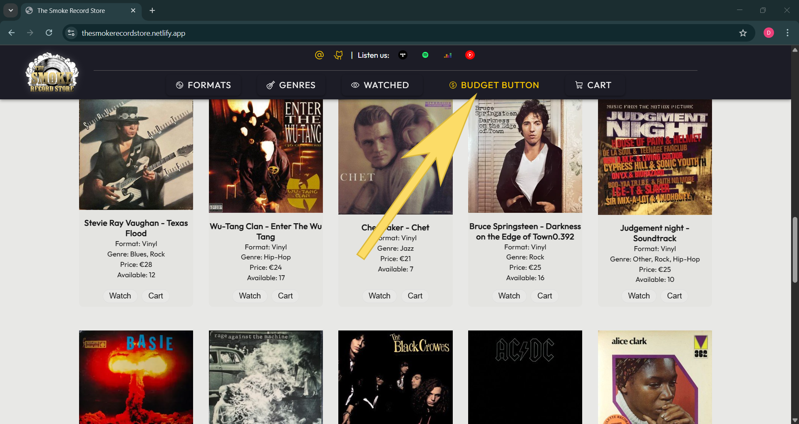
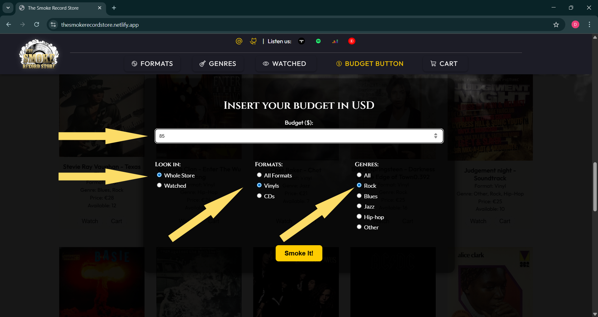
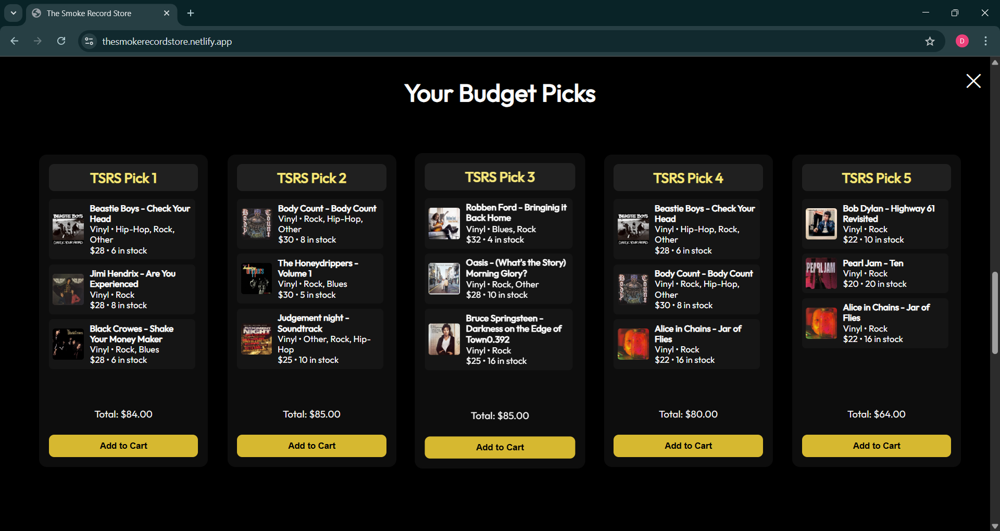

# The Smoke Record Store – The Budget Button Story...

🌐 **Live site:** [thesmokerecordstore.netlify.app](https://thesmokerecordstore.netlify.app)

The Smoke Record Store is not just a record store.

It’s a fully functional music shop designed to present one idea: the **Budget Button**.  
A unique feature, carefully integrated into the store experience — created with collectors in mind,  
to help music lovers make smarter picks within their budget.

## What is the Budget Button?

The Budget Button helps collectors make smart, focused choices.  
It starts where it matters most: with your budget — and makes you want to come back to it again.

#### What the Budget Button is not:

- It’s not a min-max price filter.
- It’s not a filter menu.
- It’s not a price sorter.
- It’s not a wishlist.
- It’s not a randomizer or discovery tool.
- It’s not designed to show you everything — just the right things, based on your budget and priorities.

#### What the Budget Button actually is:

- A logic-based suggestion engine built for collectors.
- A tool that turns your budget into a set of curated options.
- A system that weighs stock, price, rarity, rating and availability.
- A way to get the most value out of what you can spend.
- A dynamic selector, not tied to fixed filters or categories.
- A collector's shortcut — not to more, but to better.

#### What makes the Budget Button different

What makes the Budget Button different is simple: it's the only button that starts by asking how much money you have — and responds with real suggestions. Each set of five picks is based on collector signals you've sent, processed through multiple music collectors-logic layers built into the system. It's not generic, not random, and not driven by trends — it's built to respect your limits and your taste.

## The Budget Button: Behind the Scenes

#### What happens when you click the Budget Button?

When a user clicks the Budget Button, a full-screen panel opens and asks for four key inputs:

- Where to search: Whole Store or Watched list
- Format: All Formats, Vinyls or CDs
- Genre: one or all styles
- Budget: enter an amount in dollars

Once the user confirms by clicking **“Smoke it!”**, the system filters the entire album pool based on the selected inputs.  
Then, it automatically selects and triggers one of 12 predefined scenarios and 4 smart picks, depending on the combination of user choices.

Each scenario uses its own logic to analyze the filtered albums and generate five unique suggestions — ranked and scored according to availability, pricing, rating, bb score and collector-oriented methods.





#### Parameters - album data structure

Each album is represented as a card containing the following parameters.  
Not all parameters are used in every Budget Button calculation — some are optional, depending on the scenario or logic.

```js
{
  id: 1,
  title: "Jimmy Smith – Root Down",
  format: "Vinyl" or "CD",
  genre: "Rock, Blues, Jazz, Hip-Hop, Other",
  price: 1,
  stock: 1,
  cover: "images/covers-thumbs/…",
  rating: 0.1,
  boost: 0, // default value
  bbScore: // calculated based on scoring logic
}

```

#### Rules

- There are 12 core scenarios in the system.
- An additional 4 scenarios are triggered when the user selects "ALL" in one of the categories (Whole Store, All Genres, or All Formats).
- Each scenario returns 5 suggestions.
- A single suggestion cannot contain two albums with the same title, regardless of format  
  (e.g. one vinyl and one CD version of the same album are not allowed in the same pick).
- Within a single scenario, the same album can appear in different picks no more than twice.
- Every calculation includes a `boost` value (default: 0), used for rewarding or penalizing certain releases.  
  This is useful for highlighting new arrivals, pressing types (e.g. Japan press), condition-specific picks or even as a strategic push for slower-moving albums.
- The number of albums in a single pick is not fixed — it can be just one (if the logic demands it), with no defined upper limit.

#### Scoring System (BB scoring logic)

The Budget Button assigns points to each album based on a combination of weighted factors.  
Each value contributes to the album's overall `bbScore`. Below is a breakdown of how scoring is calculated.

---

**Search Scope Multiplier**

| Scope          | Multiplier |
| -------------- | ---------- |
| Whole Store    | ×1.00      |
| Watched Albums | ×1.30      |

_Watched albums are slightly prioritized, assuming stronger collector interest._

---

**Format Multiplier**

| Format | Multiplier | Notes                                         |
| ------ | ---------- | --------------------------------------------- |
| Vinyl  | ×1.07      | Slightly rewarded for higher collector appeal |
| CD     | ×0.84      | Balanced against pricing and availability     |
| All    | ×1.00      | No format preference selected                 |

---

**Stock-Based Score**

| Stock Quantity | Score Contribution |
| -------------- | ------------------ |
| > 30           | 0.00               |
| > 19           | 0.16               |
| > 9            | 0.27               |
| > 3            | 0.31               |
| ≥ 1            | 0.47               |

_Albums with low stock are prioritized — scarcity increases their score._

---

**Price-Based Score**

| Price Range (in $) | Score Contribution   |
| ------------------ | -------------------- |
| > 30               | 0.32                 |
| > 19               | 0.43                 |
| > 9                | 0.55                 |
| ≤ 9                | 0.66 – P (P = price) |

_Lower-priced albums are favored — especially when they fall below $10._

---

**Rating**

Community ratings (e.g. from [rateyourmusic.com](https://rateyourmusic.com/)) are used as part of the score, when available.

---

**Boost**

The `boost` parameter is an optional manual value (default: 0) used to increase visibility for specific albums during scoring.  
Ideal for new arrivals, special pressings (e.g. Japan press), or strategic promotional picks.

---

**Additional Bonuses**

- **Genres**: +1.23  
  If the user selects a specific genre, all albums matching that genre receive a flat bonus of +1.23 points.

- **Formats**:  
  Format bonuses are already applied via the multiplier table above and are not recalculated here.

### Methods

The Budget Button uses four core logic types to generate suggestions.  
Each scenario may use a single method or combine multiple methods depending on the user's input and selection context.

---

**1. Scoring Logic (SC)**

- Standard point-based selection.
- Sum all scores → sort descending → select until the budget limit is reached.
- Can be used together with a physical store split (BB-P1P2-Split-Filter) to give edge-case albums a better chance of appearing.

---

**2. Predefined Recommendation Flow (PRF)**

- Manually defined formula sequences.
- From each formula, albums are selected in order until the budget is used up.
- Includes the **Scoring Cycle** (1-2-3 rotation) — alternates top albums from the first, second, and third third of the store based on defined parameters.
- PRF also includes its own version of the P1P2-Split-Filter — applying SC logic to each half of the store separately, combined with shuffle and duplicate avoidance.

In scenarios that include watched albums:

- The first 3 picks are based on the watched list, using PRF logic (e.g. bbScore, price, stock, rating, rotations).
- The last 2 picks follow one of the following PRF sub-methods:

  1. `PRF: Dominant Format Filter → Whole Store → Scoring by bbScore`  
     Detects dominant format in the watched list, applies scoring on matching items from the full store.

  2. `PRF: Dominant Genre Filter → Whole Store → Scoring by price`  
     Detects dominant genre in the watched list, then scores matching albums in the full store.

- If two formats or two genres have the same watched count, a random tie-break is applied.

---

**3. Smart Override Protocol (SOP)**

- Activated when the user selects "Whole Store" or leaves Format/Genre set to "All", while having at least one watched album.
- SOP analyzes the watched list for a dominant format, genre, or rating signal to steer the pick.

  - If no clear dominant signal is found (e.g. 3 Jazz + 3 Rock), there are three fallback strategies:
    1. Don’t activate SOP, proceed with SC or PRF as defined by the scenario.
    2. Randomly choose one of the dominant values (genre or format).
    3. Use secondary signals: rating, price, stock.

- During testing, fallback option 1 or 2 is preferred.
- SOP is applied to **a maximum of 2 picks** per scenario.

---

**4. Global Shuffle**

- Runs once per scenario (when "Smoke It!" is clicked).
- Applies globally to the filtered album pool, not inside individual pick functions.
- Ensures varied results across sessions without breaking scoring fairness.

#### Scenario System

Scenarios are the core structure of how the Budget Button delivers recommendations.  
Each scenario represents a specific combination of user-selected options (scope, format, genre),  
and triggers a predefined logic path using one or more BB methods.

---

**Structure**

- There are **12 base scenarios**, each covering a different set of user selections.
- An additional **4 scenarios** are activated when the user chooses **"All"** in one or more categories (Whole Store, All Genres, or All Formats).
- Only **one scenario** is triggered per “Smoke It!” action.

---

**How they work**

- Each scenario selects and processes albums from the filtered pool using a defined method or method combination (SC, PRF, SOP, Shuffle).
- Scenarios may be built to prioritize watched albums, focus on genre or format dominance, split the store, or simulate curated digging logic.
- Each scenario returns **5 final picks**, generated according to the rules, filters and budget constraints active at that moment.

---

**Why scenarios matter**

This modular system allows the Budget Button to scale, test, and combine logic paths  
without rewriting the entire engine. Each scenario acts like a smart recipe — balancing collector behavior, user signals, and system rules.

#### Scenarios Overview

| Scenario | Scope       | Format | Genre        |
| -------- | ----------- | ------ | ------------ |
| 1        | Whole Store | All    | All          |
| 2        | Whole Store | Vinyls | All          |
| 3        | Whole Store | CDs    | All          |
| 4        | Whole Store | All    | Chosen Genre |
| 5        | Whole Store | Vinyls | Chosen Genre |
| 6        | Whole Store | CDs    | Chosen Genre |
| 7        | Watched     | All    | All          |
| 8        | Watched     | Vinyls | All          |
| 9        | Watched     | CDs    | All          |
| 10       | Watched     | All    | Chosen Genre |
| 11       | Watched     | Vinyls | Chosen Genre |
| 12       | Watched     | CDs    | Chosen Genre |

#### Scenario 1 — Whole Store / All Formats / All Genres

**User profile:**  
The most open-ended scenario. The user has not selected **store scope**, **format**, or **genre**. This could mean:

- A new visitor unfamiliar with the catalog
- A casual browser
- A collector asking for inspiration or curated picks

**Methodology used:**  
The system uses a mix of `PRF` and `SCORING` methods to generate picks based on default priorities (rating, price, stock).

---

**Pick 1**  
`METHOD: PRF (Alternating Vinyl/CD, sorted by Rating DESC)`  
→ Alternates between vinyl and CD, prioritizing higher-rated albums until the budget is filled.

**Pick 2**  
`METHOD: PRF (Alternating Vinyl/CD, sorted by Lowest Stock)`  
→ Same alternating logic, but prioritizes albums with the lowest stock.

**Pick 3**  
`METHOD: SCORING (Pure scoring, first half of the store)`  
→ Applies raw scoring to the **first half** of the store (by ID order) and selects top items within the budget.

**Pick 4**  
`METHOD: SCORING (Pure scoring, second half of the store)`  
→ Same logic as above, applied to the **second half** of the store.

**Pick 5**  
`METHOD: PRF (Sorted by: Higher Rating → Lower Stock → Lower Price)`  
→ Prioritizes albums with high rating, then lower stock, then lower price.

#### Scenario 2 — Whole Store / Vinyls / All Genres

**User profile:**  
The user has selected only one filter — **format: Vinyl**. This may indicate two types of users:

1. **Collector / crate digger**  
   • Values vinyl for rarity and long-term worth  
   • Seeks hidden gems (low stock + good price)  
   • Less concerned with popularity

2. **Vinyl enthusiast / beginner**  
   • Looking for trusted, classic records  
   • Open-minded about genres  
   • Interested in “must-have” vinyl suggestions

**Notes:**

- No genre selected → user is open to exploration
- No albums in `Watched` → no personalization yet; either seeking inspiration or safe recommendations

**Methodology used:**  
A mix of `SCORING` and `PRF` methods with a focus on the **vinyl** format.

---

**Pick 1**  
`METHOD: SCORING (First half of the store)`  
→ Calculates pure `bbScore` from the **first half** of the store (based on ID order), and selects items until the budget is reached.

**Pick 2**  
`METHOD: SCORING (Second half of the store)`  
→ Same as above, but works with the **second half** of the store.

**Pick 3**  
`METHOD: PRF (Scoring Cycle → 1st → 2nd → 3rd tercile by bbScore)`  
→ Alternates between the three store segments, selecting best albums based on `bbScore`.

**Pick 4**  
`METHOD: PRF (Scoring Cycle → 1st → 2nd → 3rd tercile by Price)`  
→ Same rotation method, but uses `Price` as the sorting key.

**Pick 5**  
`METHOD: PRF (Sorted by: Lowest Stock → Lower Price → Higher Rating)`  
→ Selects albums following this strict sorting logic.

#### Scenario 3 — Whole Store / CDs / All Genres

**User profile:**  
The user has selected **CD format**, but left both **genre** and **store scope** open. This suggests two possible types of users:

1. **Collector / Crate Digger**

   - Looking for great deals (low stock + good price)
   - Less concerned about what’s "popular"

2. **CD Enthusiast / Beginner**
   - Wants trusted, well-rated albums
   - Not genre-specific
   - Curious to discover essential picks on CD

Since the user hasn’t selected a genre or added any albums to their watched list, the system assumes they're open to suggestions or simply browsing for inspiration.

**Methodology used:**  
A mix of `SCORING` and `PRF` strategies ensures both algorithmic accuracy and curated variation.

---

**Pick 1**  
`METHOD: SCORING (Pure scoring, first half of the store)`  
→ Applies raw scoring logic to the **first half** of the store.

**Pick 2**  
`METHOD: SCORING (Pure scoring, second half of the store)`  
→ Same scoring logic, applied to the **second half**.

**Pick 3**  
`METHOD: PRF (Scoring cycle: 1st tercile → 2nd → 3rd, based on bbScore)`  
→ Rotates across store segments using `bbScore` as the selection parameter.

**Pick 4**  
`METHOD: PRF (Scoring cycle: 1st tercile → 2nd → 3rd, based on Price)`  
→ Same rotation method, but prioritizes **Price**.

**Pick 5**  
`METHOD: PRF (Sorted by: Stock → Price → Rating)`  
→ Prioritizes albums with low stock, then better prices, then strong ratings.

#### Scenario 4 — Whole Store / All Formats / Chosen Genre

**User profile:**  
The user has selected a **specific genre**, but left the **format** open. This indicates that genre matters to them, but they're open when it comes to format — either undecided or flexible.

They haven’t added anything to their watched list, so the system assumes:

- They don’t yet know what exactly they’re looking for,
- Or they’re open to trusted recommendations and unexpected finds.

**Methodology used:**  
A balance between scoring and curated picks, with duplicate filtering to ensure unique album suggestions.

---

**Pick 1**  
`METHOD: SCORING (Pure scoring, first half of the store — with duplicate filtering)`  
→ Uses raw scoring on the first half of the store, avoiding repeated album titles.

**Pick 2**  
`METHOD: SCORING (Pure scoring, second half of the store — with duplicate filtering)`  
→ Same as above, applied to the second half.

**Pick 3**  
`METHOD: PRF (Scoring cycle: 1st tercile → 2nd → 3rd, based on bbScore)`  
→ Rotational selection across the full store, prioritizing `bbScore`.

**Pick 4**  
`METHOD: PRF (Scoring cycle: 1st tercile → 2nd → 3rd, based on Price)`  
→ Same rotation logic, now emphasizing album price.

**Pick 5**  
`METHOD: PRF (Sorted by: Stock → Price → Rating)`  
→ Prioritizes rare albums (low stock), then affordable ones, then highly rated.

#### Scenario 5 — Whole Store / Vinyls / Chosen Genre

**User profile:**  
The user has selected both a **specific genre** and the **vinyl format**, indicating clear preferences. This could point to:

- A vinyl collector looking for targeted recommendations.
- Someone with specific taste in music, but flexible across artists or price points.
- A user searching for valuable or rare vinyl releases within a genre.

The user hasn’t added anything to the watched list, so the picks are based purely on logic and scoring.

**Methodology used:**  
A hybrid approach using scoring and curated logic, with **duplicate filtering** and rotational selection based on key collector signals.

---

**Pick 1**  
`METHOD: SCORING (Pure scoring, first half of the store — with duplicate filtering)`  
→ Selects from the first half of the vinyl inventory, ranked by calculated score.

**Pick 2**  
`METHOD: SCORING (Pure scoring, second half of the store — with duplicate filtering)`  
→ Same logic, applied to the second half.

**Pick 3**  
`METHOD: PRF (Scoring cycle: 1st tercile → 2nd → 3rd, based on lowest stock)`  
→ Focuses on rarity, rotating through the store tiers.

**Pick 4**  
`METHOD: PRF (Scoring cycle: 1st tercile → 2nd → 3rd, based on bbScore)`  
→ Prioritizes overall score with even distribution.

**Pick 5**  
`METHOD: PRF (Scoring cycle: 1st tercile → 2nd → 3rd, based on lowest price)`  
→ Surfaces affordable vinyls within the chosen genre.

#### Scenario 6 — Whole Store / CDs / Chosen Genre

**User profile:**  
The user selected a **specific genre** and **CD format**, signaling a focused but potentially cost-conscious interest. This might be:

- A CD collector looking for targeted deals.
- A music enthusiast browsing within a favorite genre.
- A user open to suggestions but constrained to a specific format.

The user has not added albums to the watched list, so all logic is system-driven.

**Methodology used:**  
A structured mix of scoring and priority-based rotation, including **duplicate filtering** and logic based on stock, score, and price.

---

**Pick 1**  
`METHOD: SCORING (Pure scoring, first half of the store — with duplicate filtering)`  
→ Ranks and selects from the first half of the CD inventory.

**Pick 2**  
`METHOD: SCORING (Pure scoring, second half of the store — with duplicate filtering)`  
→ Same method, applied to the second half.

**Pick 3**  
`METHOD: PRF (Scoring cycle: 1st tercile → 2nd → 3rd, based on lowest stock)`  
→ Prioritizes rare CDs within the selected genre.

**Pick 4**  
`METHOD: PRF (Scoring cycle: 1st tercile → 2nd → 3rd, based on bbScore)`  
→ Balanced picks based on overall collector value.

**Pick 5**  
`METHOD: PRF (Scoring cycle: 1st tercile → 2nd → 3rd, based on lowest price)`  
→ Highlights affordable CDs that match the user’s genre choice.

#### Scenario 7 — Watched / All Formats / All Genres

**User profile:**  
The user has selected the **Watched** collection as the source but did not specify format or genre. This suggests:

- A user who trusts their own saved selections.
- They’re looking for optimized picks from albums they already expressed interest in.
- Format and genre flexibility allows the system to use dominant signals (if present).

**Methodology used:**  
Combination of curated logic (PRF) and dominant signal analysis from the watched list.

---

**Pick 1**  
`METHOD: PRF (Scoring cycle: 1st → 2nd → 3rd tercile, based on bbScore)`  
→ Selects from **Watched** albums using bbScore rotation logic.

**Pick 2**  
`METHOD: PRF (Scoring cycle: 1st → 2nd → 3rd tercile, based on lowest stock)`  
→ Highlights rare or low-quantity albums from the **Watched** list.

**Pick 3**  
`METHOD: PRF (Scoring cycle: 1st → 2nd → 3rd tercile, based on lowest price)`  
→ Targets affordable choices within the **Watched** albums.

**Pick 4**  
`METHOD: PRF (Dominant Format Filter → Whole store → Scoring by rating)`  
→ Analyzes the most frequent format from **Watched**, then pulls rated albums from the full store accordingly.  
→ If no dominant format is detected, selection is randomized.

**Pick 5**  
`METHOD: PRF (Dominant Genre Filter → Whole store → Scoring by rating)`  
→ Identifies dominant genre from **Watched**, then scores full store albums accordingly.  
→ Falls back to random selection if tied.

#### Scenario 8 — Watched / Vinyls / All Genres

**User profile:**  
The user has selected **Watched** albums, limited to **Vinyl** format, with no genre preference. This indicates:

- A vinyl-focused collector or enthusiast who has previously saved favorites.
- Genre flexibility means the system can focus on availability, price, and rating signals.
- Personalization comes from the watched list, format filter adds precision.

**Methodology used:**  
Mix of scoring and personalized rotation logic, including dominant genre analysis.

---

**Pick 1**  
`METHOD: SCORING (pure scoring, first half of the store)`  
→ Full scoring algorithm applied to the first half of the store, filtered by Watched + Vinyl.

**Pick 2**  
`METHOD: SCORING (pure scoring, second half of the store)`  
→ Same as Pick 1, but on the second half of the store.

**Pick 3**  
`METHOD: PRF (Scoring cycle: 1st → 2nd → 3rd tercile, based on lowest stock)`  
→ Prioritizes low-stock vinyls from the watched list using rotation logic.

**Pick 4**  
`METHOD: PRF (Scoring cycle: 1st → 2nd → 3rd tercile, based on lowest price)`  
→ Targets affordable vinyl picks within the watched list.

**Pick 5**  
`METHOD: PRF (Dominant Genre Filter → Whole store → Scoring by rating)`  
→ Detects the dominant genre from the watched list and pulls high-rated vinyls from the full store.  
→ Falls back to random genre if there's a tie.

#### Scenario 9 — Watched / CDs / All Genres

**User profile:**  
The user has selected **Watched** albums, limited to the **CD** format, with no specific genre preference. This implies:

- A CD-focused collector or casual listener refining their list via Watched items.
- Genre is not a filtering factor, allowing flexibility.
- Picks are personalized through the user's watched collection, while the format is strictly CDs.

**Methodology used:**  
Balanced use of scoring, rotation (PRF), and dominant genre detection for personalization.

---

**Pick 1**  
`METHOD: SCORING (pure scoring, first half of the store)`  
→ Full scoring applied to the first half of the store, filtered by Watched + CDs.

**Pick 2**  
`METHOD: SCORING (pure scoring, second half of the store)`  
→ Same logic as Pick 1, but applied to the second half of the store.

**Pick 3**  
`METHOD: PRF (Scoring cycle: 1st → 2nd → 3rd tercile, based on lowest stock)`  
→ Prioritizes low-stock CDs from the watched list using cycle logic.

**Pick 4**  
`METHOD: PRF (Scoring cycle: 1st → 2nd → 3rd tercile, based on lowest price)`  
→ Targets affordable CDs from the watched list.

**Pick 5**  
`METHOD: PRF (Dominant Genre Filter → Whole store → Scoring by rating)`  
→ Detects the dominant genre from the user's watched list and pulls top-rated CDs from the entire store.  
→ If there's a tie in genre dominance, the genre is chosen randomly.

#### Scenario 10 — Watched / All Formats / Chosen Genre

**User profile:**  
The user has selected a specific **genre**, while keeping **all formats** open and limiting the search to their **Watched** albums. This implies:

- Strong genre preference (e.g., Jazz, Rock, etc.).
- Format flexibility: both Vinyls and CDs are considered.
- Picks are personalized through the user's watched list.

**Methodology used:**  
Combination of scoring and rotation (PRF) across both formats and dominant format extraction logic.

---

**Pick 1**  
`METHOD: SCORING (pure scoring, first half of the store)`  
→ Applies pure scoring to the first half of the store, filtered by Watched + chosen genre.

**Pick 2**  
`METHOD: SCORING (pure scoring, second half of the store)`  
→ Same logic as Pick 1, applied to the second half.

**Pick 3**  
`METHOD: PRF (Scoring cycle: 1st → 2nd → 3rd tercile, based on lowest stock)`  
→ Focuses on albums with the lowest stock, rotating by thirds of the store.

**Pick 4**  
`METHOD: PRF (Scoring cycle: 1st → 2nd → 3rd tercile, based on lowest price)`  
→ Prioritizes affordability across watched items in the chosen genre.

**Pick 5**  
`METHOD: PRF (Dominant Format Filter → Whole store → Scoring by rating)`  
→ Detects the dominant format (Vinyl or CD) from the user's watched list, and pulls top-rated albums from the whole store accordingly.  
→ If no clear dominant format, one is selected at random.

#### Scenario 11 — Watched / Vinyls / Chosen Genre

**User profile:**  
This user is focused and specific:

- They have a **Watched** list (personalized),
- They're only interested in **Vinyls**,
- And they’ve selected a **specific genre**.

This profile likely reflects a **collector or genre-specific vinyl enthusiast**.

**Methodology used:**  
A mix of pure scoring, rotation logic, and deep filtering based on format and genre preferences.

---

**Pick 1**  
`METHOD: SCORING (pure scoring, first half of the store)`  
→ Scores all matching albums from the first half of the store (Vinyl + chosen genre + Watched).

**Pick 2**  
`METHOD: SCORING (pure scoring, second half of the store)`  
→ Same logic as Pick 1, applied to the second half.

**Pick 3**  
`METHOD: PRF (Scoring cycle: 1st → 2nd → 3rd tercile, based on lowest stock)`  
→ Focuses on albums with lowest stock, rotated by thirds of the store.

**Pick 4**  
`METHOD: PRF (Scoring cycle: 1st → 2nd → 3rd tercile, based on lowest price)`  
→ Prioritizes more affordable vinyl picks from the watched list.

**Pick 5**  
`METHOD: PRF (Whole store → Vinyls → Chosen genre → Scoring by rating)`  
→ Searches the entire store for vinyl albums within the selected genre and ranks them by highest rating.

#### Scenario 12 — Watched / CDs / Chosen Genre

**User profile:**  
This user is very specific:

- They have a **Watched** list (personalized),
- They're only interested in **CDs**,
- And they’ve selected a **specific genre**.

This is likely a **dedicated CD collector** or someone looking for trusted recommendations within a known taste.

**Methodology used:**  
A combination of personalized scoring, rotation strategies, and deep filtering focused on CDs and genre.

---

**Pick 1**  
`METHOD: SCORING (pure scoring, first half of the store)`  
→ Evaluates watched CD albums within the selected genre from the first half of the store.

**Pick 2**  
`METHOD: SCORING (pure scoring, second half of the store)`  
→ Same logic applied to the second half.

**Pick 3**  
`METHOD: PRF (Scoring cycle: 1st → 2nd → 3rd tercile, based on lowest stock)`  
→ Focuses on CD albums with lowest stock across watched list, rotated by store segments.

**Pick 4**  
`METHOD: PRF (Scoring cycle: 1st → 2nd → 3rd tercile, based on lowest price)`  
→ Targets budget-friendly CD picks from the watched list and chosen genre.

**Pick 5**  
`METHOD: PRF (Whole store → CDs → Chosen genre → Scoring by rating)`  
→ Searches the entire store, filtered to CDs within the chosen genre, and selects by highest rating.

---

### SMART PICKS

Smart Picks are used in Scenarios 1–4 **only if the user has albums in their Watched list**, but hasn’t explicitly selected a "Watched" scenario.

#### Conditions

- If **Watched is empty**, regular scenario logic applies (no Smart Pick).
- If **Watched contains items**, the scenario behaves normally **except for Pick 5**, which becomes a Smart Pick based on data from the user's watched list.
- Depending on the scenario, the Smart Pick logic uses either the **dominant genre** or **dominant format** from the Watched list.
- If there's a tie (e.g., multiple dominant genres or formats), the system uses **random selection**.

---

#### Scenario 1 – Smart Pick

**User selection:**

- Whole store
- All formats
- All genres

**Smart Pick (Pick 5):**  
`METHOD: PRF (Dominant Genre Filter → Whole store → Scoring by bbScore)`  
→ If dominant genre is tied, genre is chosen randomly.

---

#### Scenario 2 – Smart Pick

**User selection:**

- Whole store
- Vinyls
- All genres

**Smart Pick (Pick 5):**  
`METHOD: PRF (Dominant Genre Filter → Whole store → Vinyls → Scoring by bbScore)`  
→ If dominant genre is tied, genre is chosen randomly.

---

#### Scenario 3 – Smart Pick

**User selection:**

- Whole store
- CDs
- All genres

**Smart Pick (Pick 5):**  
`METHOD: PRF (Dominant Genre Filter → Whole store → CDs → Scoring by bbScore)`  
→ If dominant genre is tied, genre is chosen randomly.

---

#### Scenario 4 – Smart Pick

**User selection:**

- Whole store
- All formats
- Chosen genre

**Smart Pick (Pick 5):**  
`METHOD: PRF (Dominant Format Filter → Whole store → Chosen genre → Scoring by bbScore)`  
→ If dominant format is tied, format is chosen randomly.

---

## Project Summary & Next Steps

### 🔧 What’s Done So Far

- **Idea:** Concept of a digital vinyl & CD record store with built-in budget assistant.
- **Branding:** Custom-designed logo with minimalist black & white aesthetic.
- **Technologies Used:**  
  HTML • CSS • JavaScript (Vanilla) • JSON (for data)

- **Key Features Implemented:**
  - Sticky navigation with fullscreen intro section
  - Dropdown filters for Genres and Formats
  - Budget Button system with 12 dynamic scenarios + Smart Picks logic
  - Pagination and dynamic rendering of album cards
  - Basic Watch list and Cart functionality
  - Full project documentation (README) with explanation of logic & methodology

---

### What’s Next

- Full responsive design pass (mobile-first revisions)
- Local storage integration for Watch and Cart features
- Micro-interactions and animation polishing
- Enhanced BB results visuals (badges, scores, alerts)
- Admin panel for adding/editing albums (future-proofing)
- Deployment to GitHub Pages or Netlify

---
